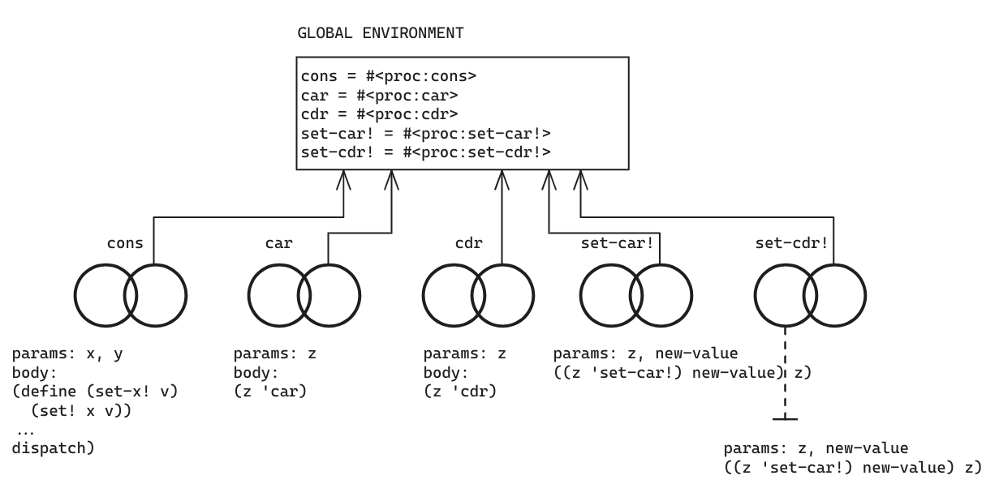
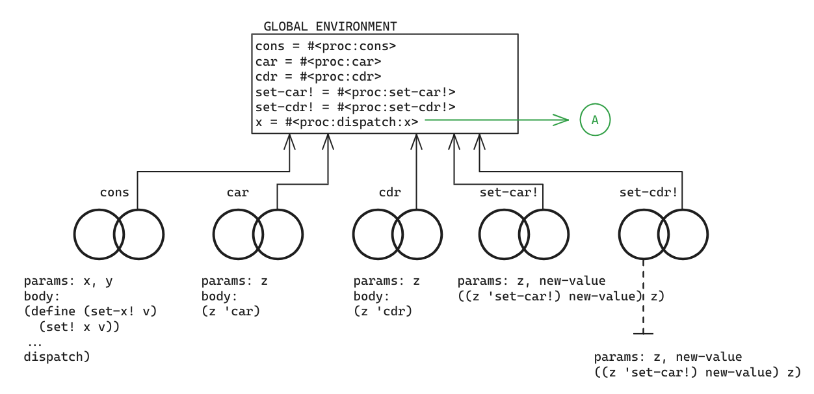
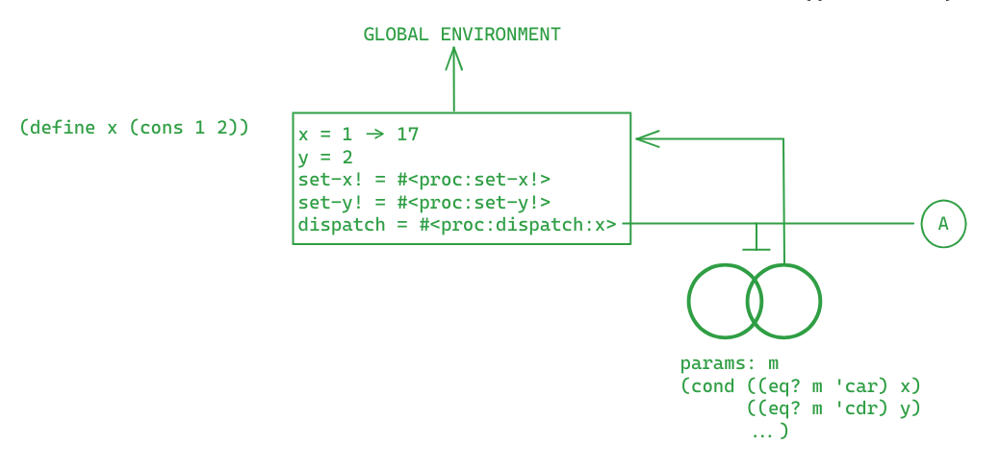
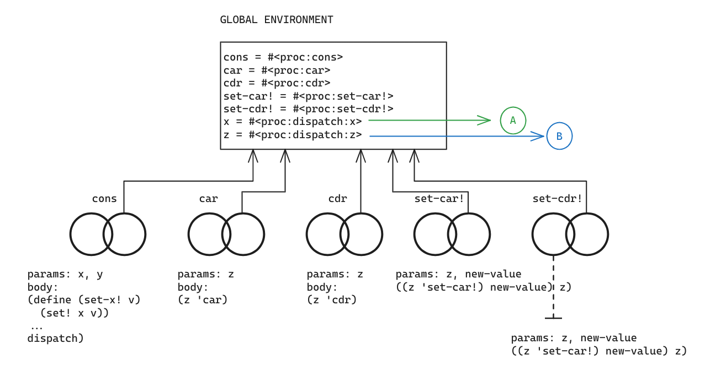
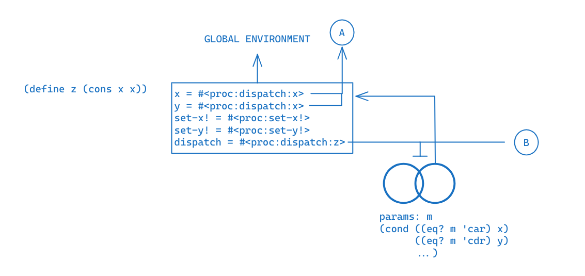
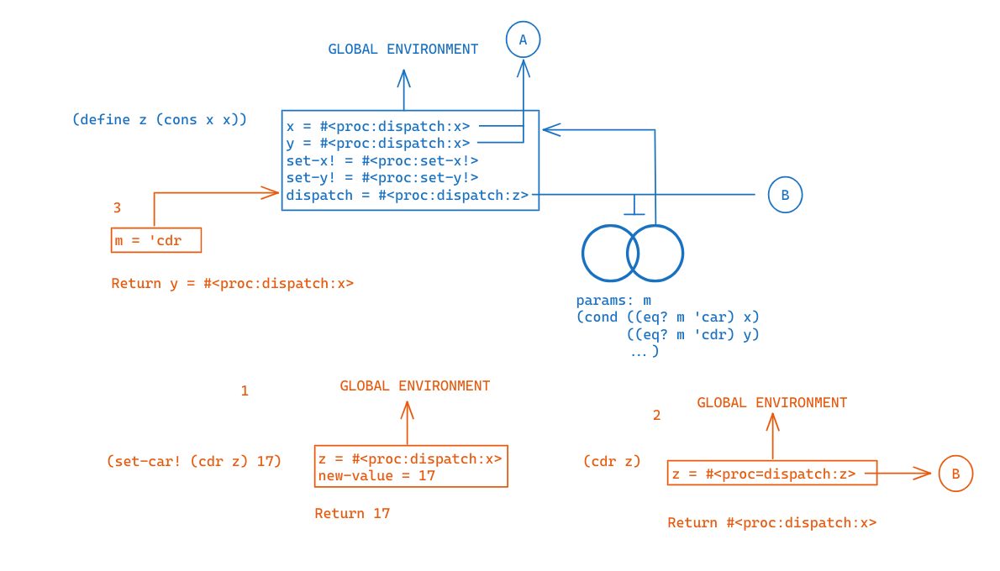
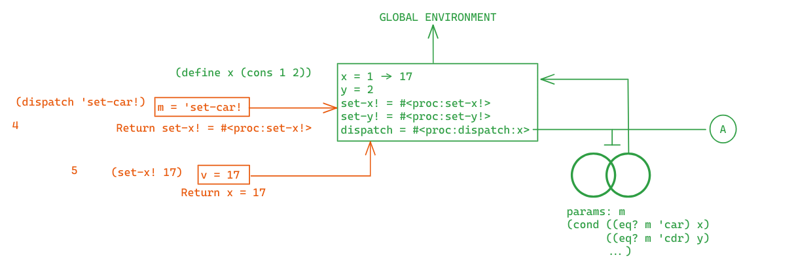
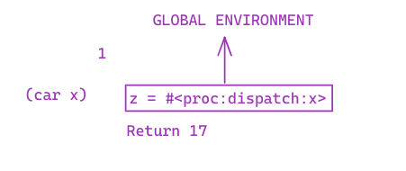
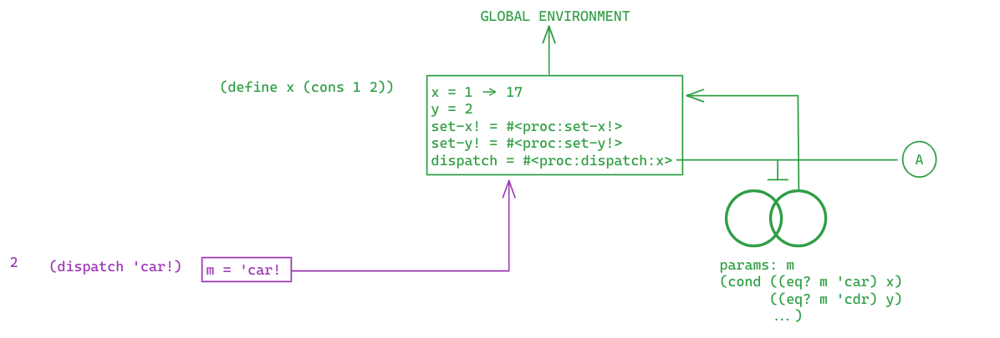
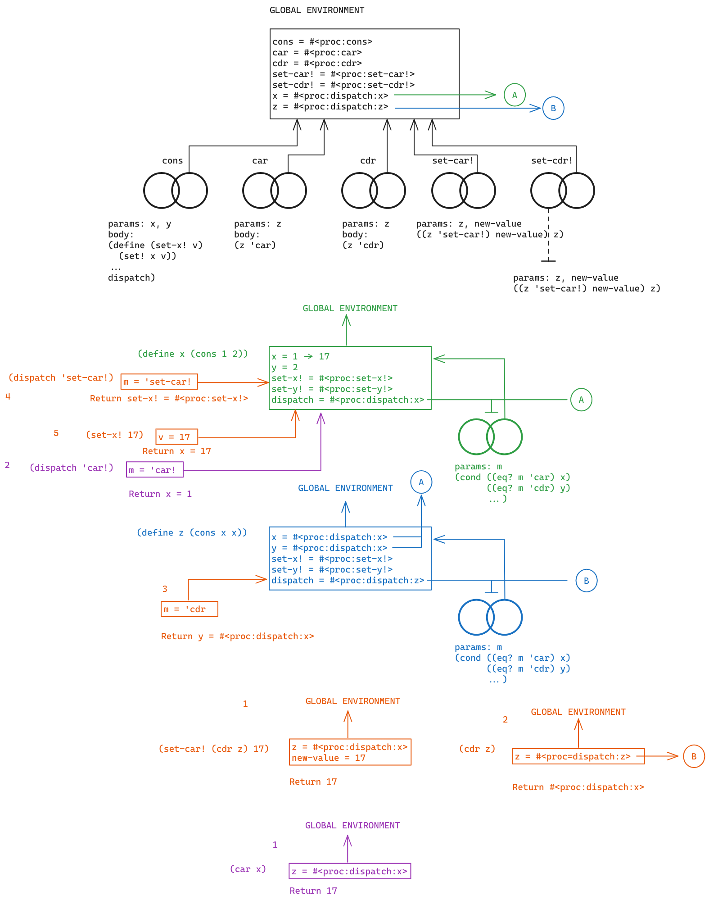

```racket
(define (cons x y)
  (define (set-x! v) (set! x v))
  (define (set-y! v) (set! y v))
  (define (dispatch m)
    (cond ((eq? m 'car) x)
          ((eq? m 'cdr) y)
          ((eq? m 'set-car!) set-x!)
          ((eq? m 'set-cdr!) set-y!)
          (else
            (error "Undefined operation: CONS" m))))
  dispatch)
(define (car z) (z 'car))
(define (cdr z) (z 'cdr))
(define (set-car! z new-value)
  ((z 'set-car!) new-value)
  z)
(define (set-cdr! z new-value)
  ((z 'set-cdr!) new-value)
  z)
```
After running all the defines above


```racket
(define x (cons 1 2))
```
Object x will be defined in the global environment


A new frame will be created for evaluating (cons 1 2)


```racket
(define z (cons x x))
```
Object z will be defined in the global environment


A new frame will be created for evaluating (cons x x)


```racket
(set-car! (cdr z) 17)
```
Evaluating (set-car! (cdr z) 17) requires several steps

1. To evaluate the whole expression, we must find z by evaluating
    (cdr z)
2. (cdr z) instances procedure associated to symbol 'z', saved in
    the global environment (formal parameter and argument names are a
    coincidence)
3. (dispatch 'cdr) returns the appropriate value, the y defined in the 'blue'
    environment

Now that we found z = the procedure associated with global symbol 'x',
we evaluate (set-car! x 17)

4. This dispatch procedure lives in the 'green' environment.
    (dispatch 'set-car!) returns procedure set-x!, from the same environment.
5. (set-x! 17) changes x from the same environment into 17. Returns 17.

```racket
(car x)
```
Finally, evaluating (car x) results in:
1. Invoking procedure x (dispatch) with argument m = 'car<br>

2. Returning variable x from the green environment.<br>



