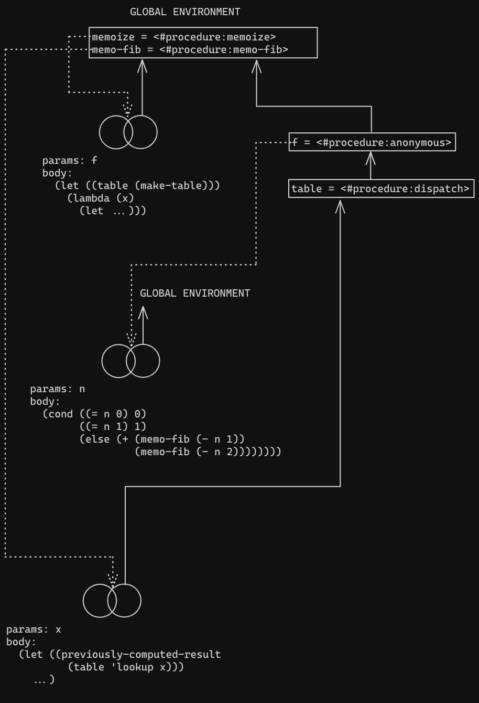
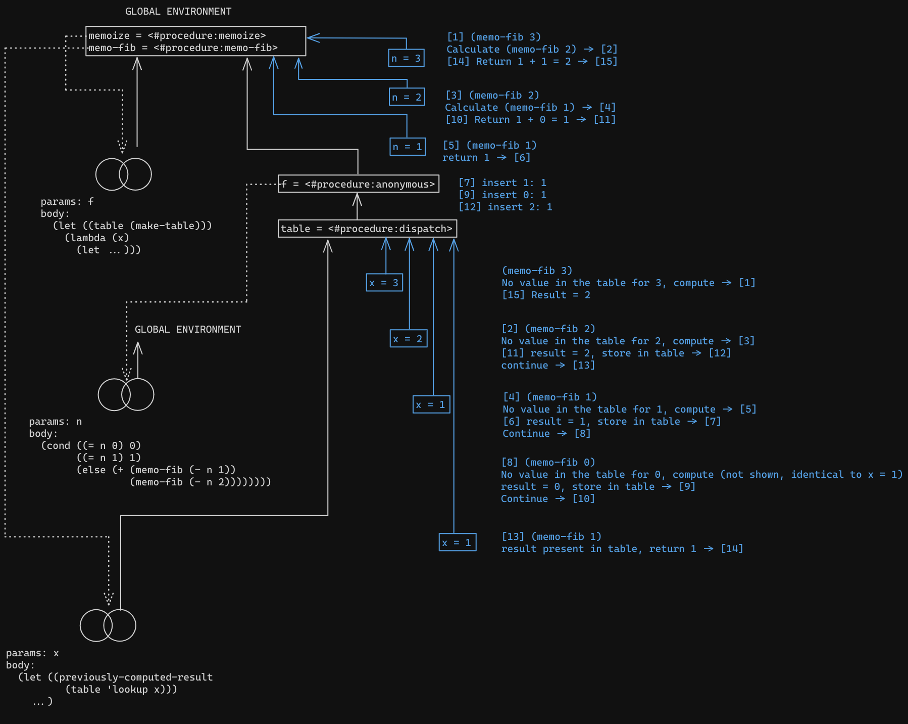

# Exercise 3.27, diagrams

```racket
(define (memoize f)
  (let ((table (make-table cmp-numbers)))
    (lambda (x)
      (let ((previously-computed-result (table 'lookup (list x))))
        (if previously-computed-result
          (printf "found ~a in table\n" x)
          (display "X\n"))
        (or previously-computed-result
            (let ((result (f x)))
              (table 'insert! (list x) result)
              result))))))

(define memo-fib
  (memoize
    (lambda (n)
      (cond ((= n 0) 0)
            ((= n 1) 1)
            (else (+ (memo-fib (- n 1))
                     (memo-fib (- n 2))))))))
```
Diagrams after definitions


```racket
(memo-fib 3)

Diagrams after applying 3 to memo-fib

