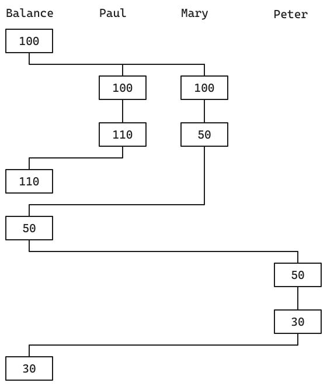

> Suppose that Peter, Paul, and Mary share a joint bank account
> that initially contains $100. Concurrently, Peter deposits $10,
> Paul withdraws $20, and Mary withdraws half the money in the
> account, by executing the following commands:
> 
> Peter: (set! balance (+ balance 10))
> Paul:(set! balance (- balance 20))
> Mary:(set! balance (- balance (/ balance 2)))

> a. List all the different possible values for balance after
> these three transactions have been completed, assuming that
> the banking system forces the three processes to run
> sequentially in some order.

There are 3! = 6 cases:

## Option 1:
- Peter:    +$10 = $110
- Paul:     -$20 = $90
- Mary:     -$45 = $45

## Option 2:
- Peter:    +$10 = $110
- Mary:     -$55 = $55
- Paul:     -$20 = $35

## Option 3:
- Mary:     -$50 = $50
- Peter:    +$10 = $60
- Paul:     -$20 = $40

## Option 4:
- Mary:     -$50 = $50
- Paul:     -$20 = $30
- Peter:    +$10 = $40

## Option 5:
- Paul:     -$20 = $80
- Peter:    +$10 = $90
- Mary:     -$45 = $45

## Option 6:
- Paul:     -$20 = $80
- Mary:     -$40 = $40
- Peter:    +$10 = $50

> b. What are some other values that could be produced
> if the system allows the processes to be interleaved?
> Draw timing diagrams like the one in Figure 3.29 to
> explain how these values can occur.

There are two events for each transaction (a read and a write), which
totals 6 events. These events can be ordered in 90 ways, counting only
those cases where internal order is kept. The only new behavior we get
with interleaved transactions is having multiple versions of the state
of `balance`. For example:

