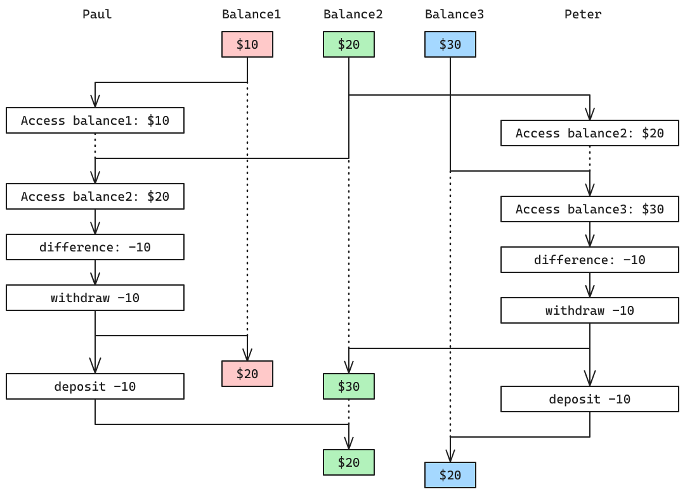

> Suppose that the balances in three accounts start out as $10, $20, and $30,
and that multiple processes run, exchanging the balances in the accounts.
Argue that if the processes are run sequentially, after any number of
concurrent exchanges, the account balances should be $10, $20, and $30 in some
order.

If no interleaving takes place, no other balances can arise by exchanging
values.

> Draw a timing diagram like the one in Figure 3.29 to show how this
condition can be violated if the exchanges are implemented using the first
version of the account-exchange program in this section.

> On the other hand, argue that even with this exchange program, the sum of the
balances in the accounts will be preserved. Draw a timing diagram to show how
even this condition would be violated if we did not serialize the transactions
on individual accounts.

The sum of balances is preserve because individual operations on accounts are
'atomic' and therefore do not break the conservation of total money.
